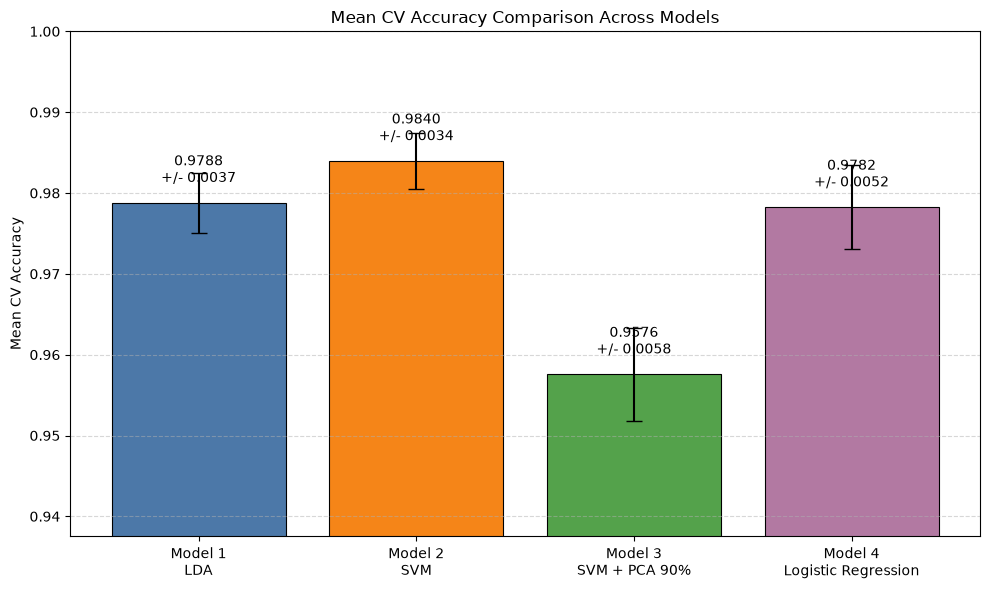
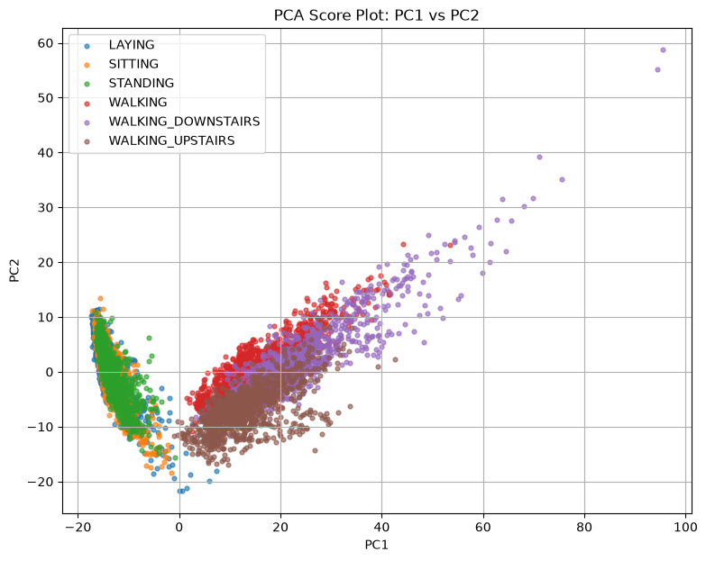

# Human Activity Recognition with Smartphone Sensor Features

多變量分析（Multivariate Analysis）課程期末資料競賽專案，Spring 2026。

利用智慧型手機 accelerometer 與 gyroscope 訊號所萃取的 561 個特徵，預測受試者當下執行的六種日常活動，並比較 LDA、Linear SVM、PCA + Linear SVM 與 L1 Logistic Regression 四種線性分類模型。

## 資料

資料源自 [UCI Human Activity Recognition Using Smartphones Dataset](https://archive.ics.uci.edu/dataset/240/human+activity+recognition+using+smartphones)（Anguita et al., 2013，CC BY 4.0）。

| | 筆數 | 欄位 |
|---|---:|---|
| `train.csv` | 7,352 | `id` + 561 features + `Activity` |
| `test.csv` | 2,947 | `id` + 561 features |

六個類別分布大致平衡（13.4% – 19.1%），無缺失值與重複資料。

資料未包含在 repository 中，下載與格式轉換方式請見 [`data/README.md`](data/README.md)。

## 方法

- **EDA**：以 PCA 觀察 561 維特徵的低維結構（僅作為視覺化工具）
- **前處理**：`StandardScaler` 標準化，並以 `Pipeline` 包裝，避免 cross-validation 時的 data leakage
- **評估**：5-fold Stratified Cross-Validation，指標為 accuracy、macro F1 與 confusion matrix

| Model | 設定 |
|---|---|
| 1. LDA | 全部 561 個特徵 |
| 2. Linear SVM | `SVC(kernel="linear", C=3)`，全部特徵 |
| 3. Linear SVM + PCA | 保留 90% 變異（63 個主成分） |
| 4. L1 Logistic Regression | `LogisticRegression(penalty="l1", C=0.1, solver="saga")` |

## 結果

| Model | Mean CV Accuracy | Std | OOF Macro F1 | Training Accuracy |
|---|---:|---:|---:|---:|
| **LDA（final submission）** | 0.9788 | 0.0037 | 0.9788 | 0.9850 |
| Linear SVM, all features | **0.9840** | 0.0034 | **0.9850** | 0.9985 |
| Linear SVM, 90% PCA | 0.9576 | 0.0058 | 0.9596 | 0.9699 |
| L1 Logistic Regression | 0.9782 | 0.0052 | 0.9793 | 0.9880 |

<p align="center">
  
</p>

### 主要發現

- **PCA 可分離動態與靜態活動**：PC1 解釋約 50.8% 的總變異，並大致將 WALKING 系列與 SITTING / STANDING / LAYING 分成兩群；但保留 90% 變異需要 63 個主成分。
- **降維反而損失分類資訊**：PCA 依變異量排序主成分，不一定對應最具判別力的方向，因此 PCA + SVM 的 accuracy 下降約 2.6 個百分點。
- **SITTING 與 STANDING 最容易混淆**：兩者皆為低動態的靜態姿勢，感測器訊號差異較小。
- **CV 最佳不等於 leaderboard 最佳**：Linear SVM 的 CV accuracy 最高，但實際提交至 Kaggle 後，LDA 的 leaderboard 表現較佳，因此最終採用 LDA。

<p align="center">
  
</p>

## 專案結構

```
.
├── data/
│   └── README.md                  # 資料來源、格式說明與重建方式
├── notebooks/
│   └── har_classification.ipynb   # EDA、模型訓練與預測
├── report/
│   ├── report.md                  # 完整報告
│   ├── report.pdf
│   └── figures/                   # PCA 圖、confusion matrix、模型比較圖
├── submissions/
│   └── submission.csv             # 最終提交（LDA）
└── requirements.txt
```

## 執行方式

```bash
pip install -r requirements.txt
```

依 [`data/README.md`](data/README.md) 將 `train.csv`、`test.csv` 放入 `data/` 後：

```bash
cd notebooks && jupyter notebook har_classification.ipynb
```

執行後各模型的預測結果會輸出至 `submissions/`（`submission.csv` 為 LDA，`model2.csv` – `model4.csv` 依序為 Model 2 – 4）。

## 報告

完整報告（Introduction、Related Work、Material、Experimental、Discussion）見 [`report/report.md`](report/report.md) 或 [`report/report.pdf`](report/report.pdf)。

## Reference

Anguita, D., Ghio, A., Oneto, L., Parra, X., & Reyes-Ortiz, J. L. (2013). A Public Domain Dataset for Human Activity Recognition Using Smartphones. *21st European Symposium on Artificial Neural Networks, Computational Intelligence and Machine Learning (ESANN 2013)*.
